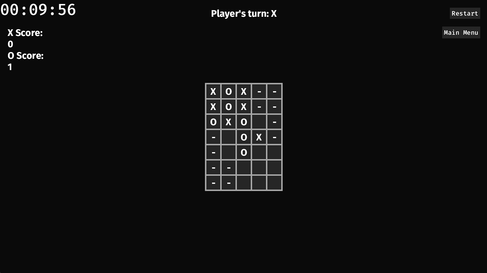

# Cascading Tic-Tac-Toe
This is a small Tic-Tac-Toe variation game with more **Complexity** and more **Fun**! 
<br>
This variant is played with two players and each player can control where they place their respective ‘X’ or ‘O’ pieces on the board. Players can choose whether to set a target score (i.e.–first to five) or a timer where the highest score wins at the end and ties are broken with sudden death.  
**New Rule1**
<br>
It contains a continuous variant of tic-tac-toe where a tie between players or a valid combination of three spaces in a row generates an additional 3x3 board that overlaps the previous board cascading down and to the right. 
<br>
**New Rule2**
<br>
When a space has been used in a valid combination of three it may still be used in another combination of three if it does not create a combination of four or more. 


## Example


## Team Member
Xu Jiang
<br>Kenny Miller
<br>Paul M Sedra
<br>Dongting Gao

# How to run
- Download the latest binary from the Release section on the right on GitHub.  
- Double-click to open the **.exe** file
- You will see the game window appearing on your screen. 

# How to contribute
Follow this project board to know the latest status of the project: [https://github.com/orgs/cis3296s24/projects/61]

### How to build
- Use this GitHub repository: [https://github.com/cis3296s24/cascading-tic-tac-toe] to clone necessary files from the main branch
- Install Rust
          <br>-- On Windows, go to https://www.rust-lang.org/tools/install
          <br>-- On Linux or macOS, open a terminal and enter the following command:
  <br>
  ```$ curl --proto '=https' --tlsv1.2 https://sh.rustup.rs -sSf | sh```
- Execute ```$cargo run``` under the src directory using basic command terminal: cmd or PowerShell(Windows)
- Once the app starts, you will see a window that contains our game, Good Luck!
